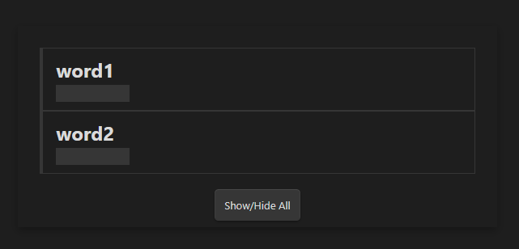

---

title: Obsidian, Markdown Examples
author: EightBitOni
date: 2023-06-08 00:00:00 -0600 # year, month, day
categories: [Obsidian, Markdown]
tags: [obsidian,markdown] # all lower case
toc: false

---


### links and mentions

[https://www.youtube.com/watch?v=d8fXEhWy_rY&t=223s ](https://www.youtube.com/watch?v=d8fXEhWy_rY&t=223s )

[https://github.com/ieshreya/Obsidian-Cheat-Sheet](https://github.com/ieshreya/Obsidian-Cheat-Sheet)

[https://facedragons.com/personal-development/obsidian-markdown-cheatsheet/](https://facedragons.com/personal-development/obsidian-markdown-cheatsheet/)


# Headers and sub headers

```
# Header 1 
##sub1
###sub2
# Header 2 
##sub2-1
# Header 3
```

example:
# Header1
## sub1
### sub2
# Header2
## sub2-1
# Header3

---

# Other formats

html
```html
<font color="red"> This text is red </font>
```
example
<font color="red"> This text is red </font>

<font color="yellow"> \.?\w+ </font>

---

how to embed code blocks
```
have to use ``` can also name the code or type of command after the first ```
```
example:
```python

python3 -c 'import pty;pty.spawn("/usr/bin/bash")'

```


---

Links use brackets to link to other notes
```
[[Name of Note]]
![[Name of note]] - a ! at the begining will render the note inside a note this can also be done with PDFs and local Videos
[[Name of Note]]|new name - pipe will output a desired name of the link
```
example:
[[Formatting in Obsidian]]

---

desired name on a web site URL
```
[New Name](https://URL)
```
example
[ObsidianFormats](https://www.youtube.com/watch?v=d8fXEhWy_rY&t=223s)

---

Creating check boxes
```
- [ ] test
- [ ] test
	- [ ] test
	- [ ] test
		- [ ] 
```

example:
- [ ] test
- [ ] test
	- [ ] test
	- [ ] test

---

creating collums
```

| one | two |
| --- | --- |
| this is another | and another |


|ID |Name|Location|description   |
| - | - | - | - |
| 1 |   |   |   |
| 2 |   |   |   |
| 3 |   |   |   |
| 4 |   |   |   |
| 5 |   |   |   |
| 6 |   |   |   |
| 7 |   |   |   |
| 8 |   |   |   |


```
example:

| one | two |
| --- | --- |
| this is another | and another |


|ID |Name|Location|description   |
| - | - | - | - |
| 1 |   |   |   |
| 2 |   |   |   |
| 3 |   |   |   |
| 4 |   |   |   |
| 5 |   |   |   |
| 6 |   |   |   |
| 7 |   |   |   |
| 8 |   |   |   |

---

embed a website

```html
<iframe src="https://www.kali.org/tools/kismet/" width="600" height="600" frameboarder="0"></iframe>
```
example
<iframe src="https://www.kali.org/tools/kismet/" width="600" height="600" frameboarder="0"></iframe>

---

embed a video

```
<video src="file:///your/path.mp4" controls></video>
```

---

embed a youtube video
```html
<iframe width="560" height="315" src="https://www.youtube.com/embed/AL3bRkx9AII" title="YouTube video player" frameborder="0" allow="accelerometer; autoplay; clipboard-write; encrypted-media; gyroscope; picture-in-picture" allowfullscreen></iframe>
```

note:
you can adjust the width and height, also you can get the embed link from the site by right clicking on the video and copy embed link

<iframe width="560" height="315" src="https://www.youtube.com/embed/AL3bRkx9AII" title="YouTube video player" frameborder="0" allow="accelerometer; autoplay; clipboard-write; encrypted-media; gyroscope; picture-in-picture" allowfullscreen></iframe>

---

vocab view

Note: vocab view is a community plugin in obsidian called vocabulary view

```
vocaview-list1
word1: explanation1
word2: explanation2
```



multiple choice

```
vocaview-choice1
question1: correct answer1
question2: correct answer2
question3: correct answer3
```

```vocaview-choice1
question1: correct answer1
question2: correct answer2
question3: correct answer3
```

question answer

```
vocaview-card1
question1: answer1
question2: answer2
question3: answer3

```
example:
```vocaview-card1
question1: answer1
question2: answer2
question3: answer3
```

---

