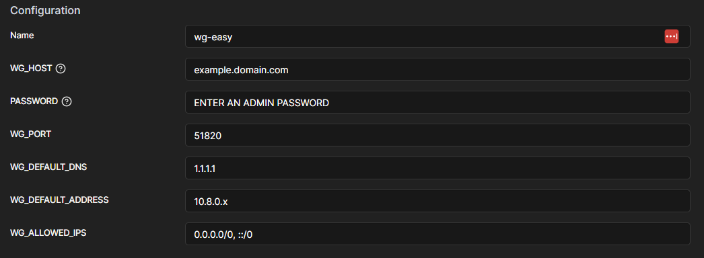

## docker and portainer install

shout out to NovaSpirit for this
[https://github.com/novaspirit/pi-hosted](https://github.com/novaspirit/pi-hosted)


```
git clone https://github.com/novaspirit/pi-hosted
```


```
./install-docker.sh
./install-portainer.sh
```


Change out templates in portainer (these are urls for container templates)

old temp url

[https://raw.githubusercontent.com/portainer/templates/master/templates-2.0.json](https://raw.githubusercontent.com/portainer/templates/master/templates-2.0.json)


new template

[https://raw.githubusercontent.com/SelfhostedPro/selfhosted_templates/master/Template/portainer-v2.json](https://raw.githubusercontent.com/SelfhostedPro/selfhosted_templates/master/Template/portainer-v2.json)


novas template

[https://raw.githubusercontent.com/pi-hosted/pi-hosted/master/template/portainer-v2-arm64.json](https://raw.githubusercontent.com/pi-hosted/pi-hosted/master/template/portainer-v2-arm64.json)

---

## Wireguard

[https://github.com/novaspirit/pi-hosted/blob/master/docs/wireguard-install.md](https://github.com/novaspirit/pi-hosted/blob/master/docs/wireguard-install.md)

To log in use the machines ip and port number 51821



make sure to enter password before deploying the container

---

## PiHole 

[https://github.com/pi-hosted/pi-hosted/blob/master/docs/pi-hole.md#post-installation](https://github.com/pi-hosted/pi-hosted/blob/master/docs/pi-hole.md#post-installation)

ip:1010

for youtube ads, you can include regex black listing like the one here, however they change time to time and i found that asking AI for a regex string works pretty well

```
`^r[0-9]+-+sn-+[a-z0-9]+-+[a-z0-9]+\.googlevideo\.com$`

`^r(?:100|[1-9]\d|\d)---sn-vgqs(?:rne(?:s|z)|kne(?:s|z)|knlz|kn7e|7ney|kne6|kn76|7ns7|ener|kn7z|knek|7nly)\.googlevideo\.com$`

`^r\d+---sn-vgqs[a-z0-9]{4}\.googlevideo\.com$`

```


## if using ubuntu server see this URL
[https://gist.github.com/zoilomora/f7d264cefbb589f3f1b1fc2cea2c844c](https://gist.github.com/zoilomora/f7d264cefbb589f3f1b1fc2cea2c844c)

might have to run these command

```
  sudo systemctl disable systemd-resolved.service
  sudo systemctl stop systemd-resolved
```
